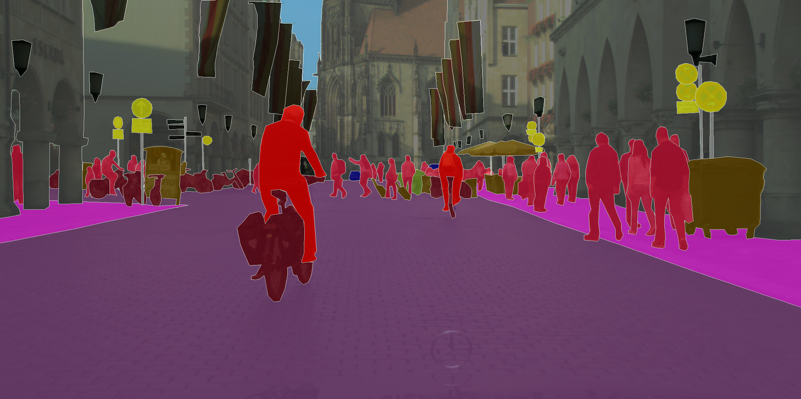
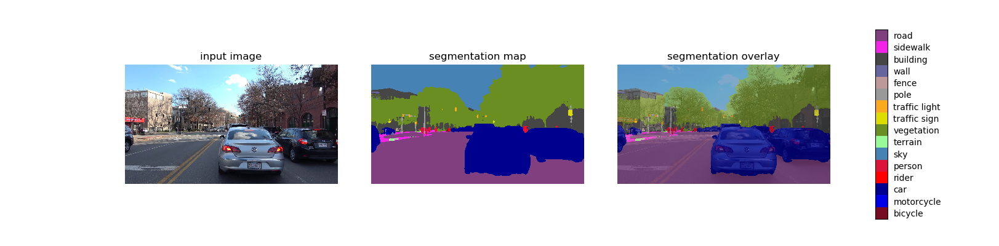

# Driving-Scene-Segmentation
Driving Scene Segmentation steps to run DeepLab semantic scene segmentation model on a sample video from MIT Driving Scene Segmentation Dataset.

## 1 - DeepLab Model Overview 

[DeepLab](https://github.com/tensorflow/models/tree/master/research/deeplab) is a state-of-art deep learning model for semantic image segmentation, where the goal is to assign semantic labels (e.g., person, dog, cat and so on) to every pixel in the input image. Some segmentation results on Flickr images:

In a scene driving context, we aim to obtain a semantic understanding of the front driving scene throught the camera input. This is important for driving safety and an essential requirement for all levels of autonomous driving. The first step is to build the model and load the pre-trained weights. In this demo, we use the model checkpoint trained on [Cityscapes](https://www.cityscapes-dataset.com/) dataset.

## 2 - Project Structure

├── Model 
│   ├── Xception65 
│   └── MobileNetV2 
├── Video 
│   └── driveseg_sample.mp4 
├── Driving_Scene_Segmentation.py 
├── DeepLabModel.py 
└── output.mp4 

## 3 - Demo Implementation

1. Intialize the model using DeepLabModel Class
2. Load the model from a frozen graph (We default to use MobileNetV2 for faster inference.)
3. Visualization
4. Run on the sample video

**NOTE** 
Loading the model could be done by downloading the model from within the code, here's a code snippet to do that: 

    MODEL_NAME = 'mobilenetv2_coco_cityscapes_trainfine'
    #MODEL_NAME = 'xception65_cityscapes_trainfine'

    _DOWNLOAD_URL_PREFIX = 'http://download.tensorflow.org/models/'
    _MODEL_URLS = {
        'mobilenetv2_coco_cityscapes_trainfine':
            'deeplabv3_mnv2_cityscapes_train_2018_02_05.tar.gz',
        'xception65_cityscapes_trainfine':
            'deeplabv3_cityscapes_train_2018_02_06.tar.gz',
    }
    _TARBALL_NAME = 'deeplab_model.tar.gz'

    model_dir = tempfile.mkdtemp()
    print("model dir: " + model_dir)
    tf.io.gfile.makedirs(model_dir)

    download_path = os.path.join(model_dir, _TARBALL_NAME)
    print("download path: " + download_path)
    print('downloading model, this might take a while...')
    urllib.request.urlretrieve(_DOWNLOAD_URL_PREFIX + _MODEL_URLS[MODEL_NAME], download_path)
    print('download completed! loading DeepLab model...')

## 4 - Output 

### Visualization Of the Input Image, Segmentation Map & Segmentation Overlay

### Resulting Video Output

You can check the full video on [Youtube here](https://www.youtube.com/watch?v=TB9UoTPsahs).

## 5 - Acknowledgements
The contents of this project is based on and inspired by the work of [TensorFlow](https://www.tensorflow.org/) team, and [MIT Human-Centered AI team](https://hcai.mit.edu/).